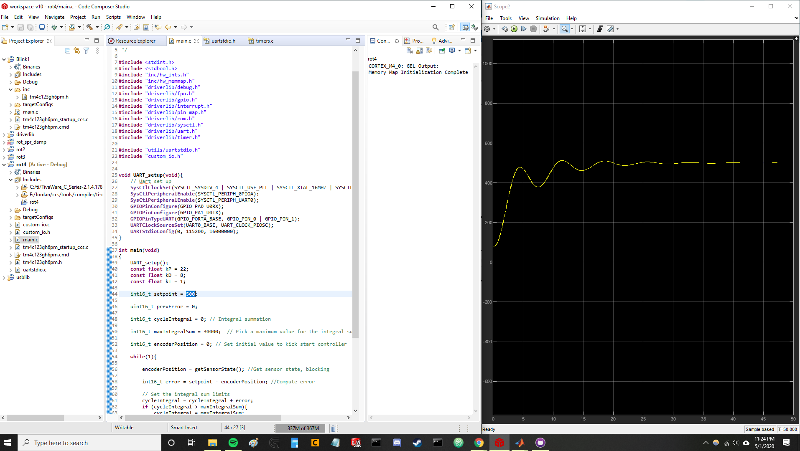
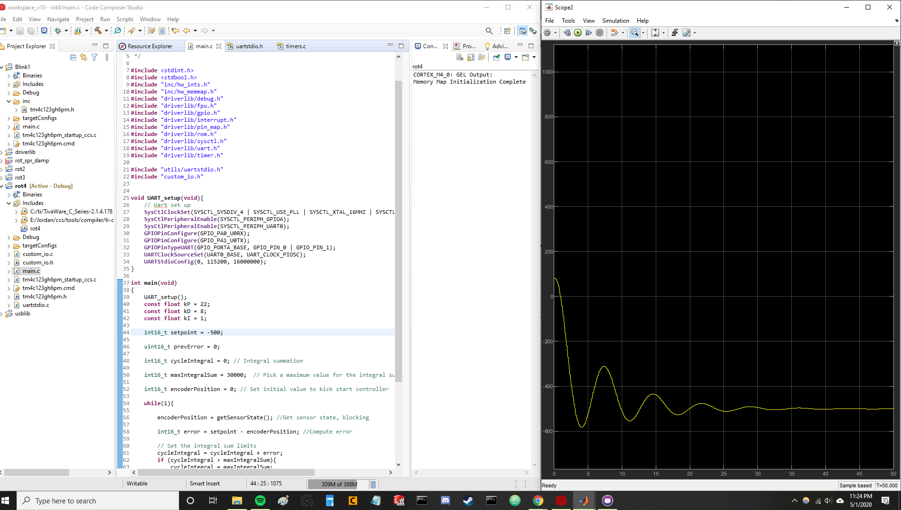

# spring_damp_pid
This is an example of using a Tiva C series development board to create a PID controller that interacts with a simulated mass-spring-dampener plant created with Simulink. 

In order to run, first upload the main.c to your Tiva board (TM4C123G).  Then, with the Tiva plugged in, run the simulink code.
You may need to change the COM port depending on what your computer sets the Tiva too. 

Below are some examples of different setpoint values:
### setpoint = 1023

### setpoint = 500

### setpoint = -500

